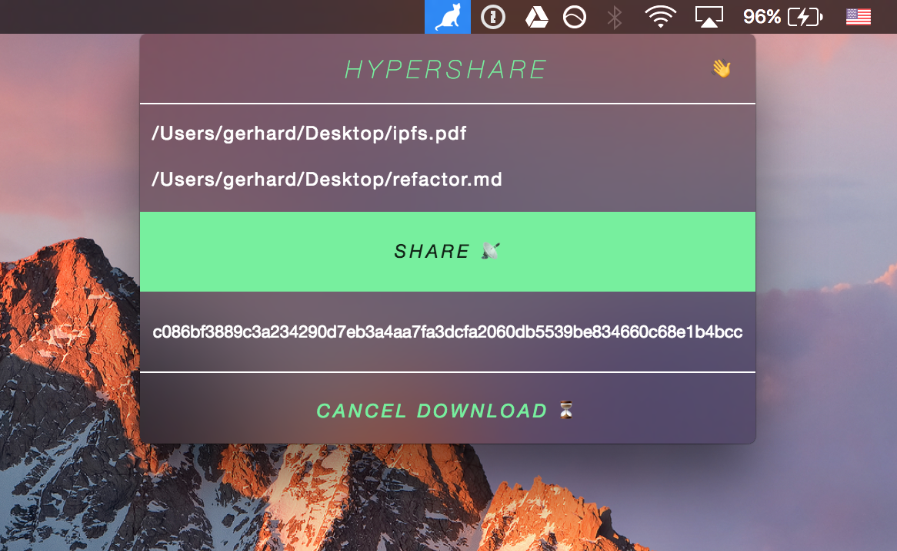

# Hypershare Desktop

A desktop application for [**hypershare**](https://github.com/gerhardberger/hypershare),
which is a peer-to-peer file sharing module based on [**hyperdrive**](https://github.com/mafintosh/hyperdrive).

  

> Currently only available for **macOS**.

You can share multiples files by generating a 64bit hash link. If another person
pastes this link in the download field of the app, it will be automatically
transferred peer-to-peer to the receiving person's system Downloads folder.
